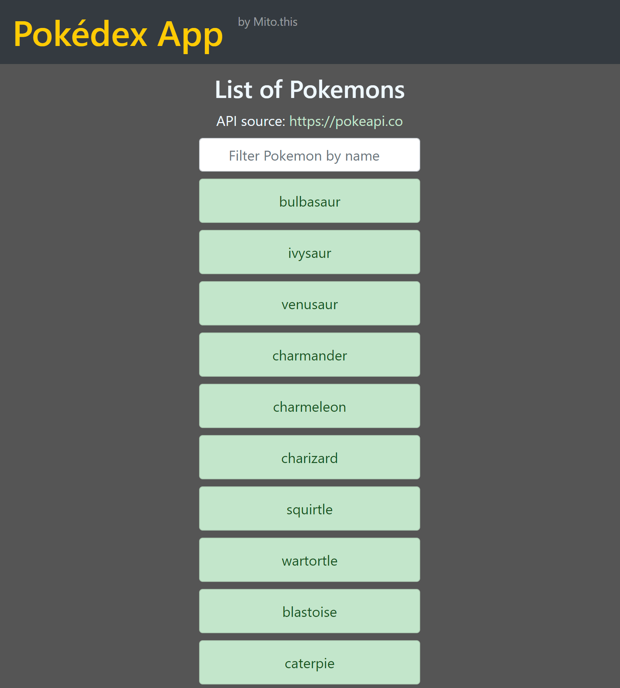
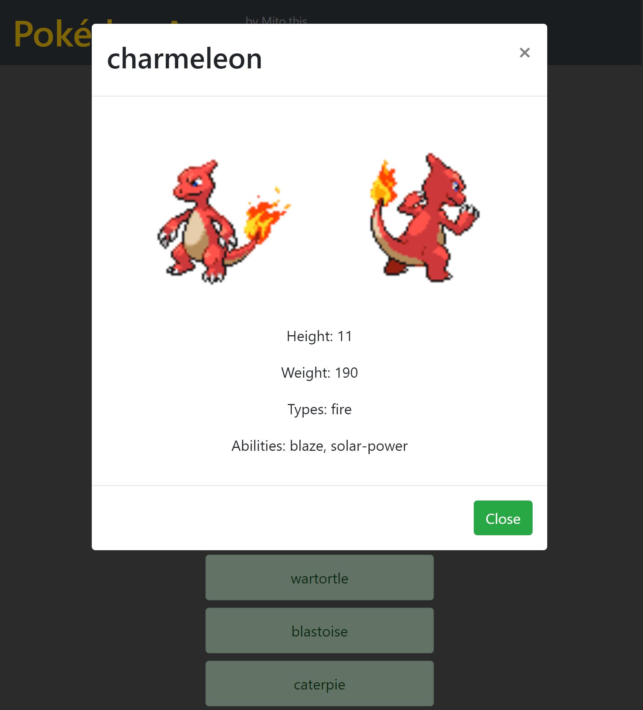

# Pokedéx app
An app to show a list of Pokemon from (https://pokeapi.co/)[https://pokeapi.co/] API, with a filter input and a modal to show details for each Pokemon.

This app was created as a study project during my Fullstack Webdeveloper course @CarrerFoundry.

# live demo
[Pokedex app](https://mitomonkey.github.io/Pokedex-App/)

## Screenshots

# Features
* Load Pokemon data from a public external API
* Render a button for each Pokemon
* Open a modal when button is clicked, to show details about the Pokemon
* Filter bar to search Pokemon by name

## Study goals
* Create a list of pokemon and implement functions to print the list to the console as well as add a new pokemon
* Substitut the list with data from an external API ((https://pokeapi.co/)[https://pokeapi.co/])
* Create DOM elements (a list of buttons) for each element from the API
* Manually create a modal (and a dialog) that shows name, height and picture of a pokemon when clicked
* Integrate bootstrap and adapt all functions and styles (as well as creating a nav-bar and replacing the modal with the bootstrap template)
* Install node.js and npm via nvp to get ESLinter and Stylelinter up and running
* Fix all linting errors, minify JS and CSS files and organize them into the folders "src" and "dist"

## Main technologies used
HTML, CSS, JavaScript, Bootstrap, jQuery, GitHub-pages

## Development environment
  * VS Code 1.58.2
  * ESlint Version 2.1.22 (with mainly recommended rules)
  * Frameworks: jQuery, Popper.js, Bootstrap JS